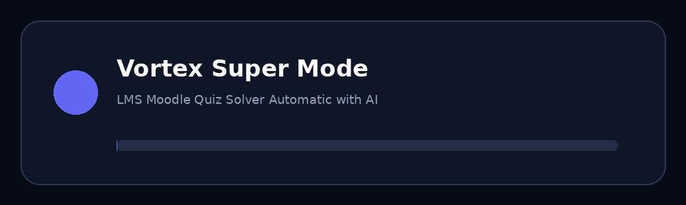

# LMS Moodle Quiz Solver Automatic with AI

## ⚡ Vortex Super Mode

**Fast local question scanning • AI Study • resilient AI connectivity • draggable Super Mode UI**




> **Repository:** `lms-moodle-quiz-solver-automatic-with-ai`

## 📌 Why the previous README showed code instead of the design

The previous README was converted through a document conversion step that produced `{=html}` artifacts. GitHub then displayed those fragments as code.

This version is **pure GitHub-compatible Markdown**. It does not depend on raw HTML/CSS/JavaScript for the layout.

Also, GitHub README files do not execute arbitrary CSS or JavaScript animations. The loading animation above is therefore an **animated GIF**, which GitHub renders directly.

---

## 🚀 Overview

**LMS Moodle Quiz Solver Automatic with AI** is a Chromium/Chrome Manifest V3 extension built around the **Vortex Super Mode** interface.

It combines:

- Local question scanning
- Question/option extraction
- Duplicate filtering
- Answer-key presentation
- Optional AI Study
- Multiple AI providers
- Local settings
- Draggable floating controls
- Futuristic dark UI
- Loading and interaction effects
- Retry and timeout handling
- Gemini model recovery

---

## ✨ Features

| Feature | Description |
|---|---|
| 🔎 Local MCQ scanner | Detects common radio, checkbox and ARIA structures |
| 🧩 Parser | Normalizes question and option text |
| ♻️ Duplicate filtering | Reduces duplicate results |
| 🕷️ Vortex button | Draggable floating control |
| ⚡ Super Mode | Compact scanning/AI panel |
| 📋 Answer Key | Displays extracted question data |
| 🤖 AI Study | Optional AI-assisted analysis |
| 🔌 AI providers | OpenAI, Gemini, Anthropic, Groq, OpenRouter and custom OpenAI-compatible |
| 💾 Local settings | Provider/model settings stored locally |
| 🔁 Retry system | Handles selected transient failures |
| ⏱️ Timeout | 30-second AI request timeout |
| ♻️ Gemini recovery | Handles unavailable saved Gemini model IDs |
| 🌑 Futuristic UI | Dark glass-style interface |
| 🎨 Themes | Customizable colors and effects |
| 📦 Manifest V3 | Modern Chromium extension architecture |

---

# 🖥️ Screenshots

## 1. Extension Popup


Shows:

- Vortex branding
- Open Super Mode
- Question count
- Saved count
- Extension state
- Moodle status
- Creator attribution

---

## 2. AI Settings


Shows:

- Provider selection
- API key field
- Model field
- Save settings
- Connection test
- Local storage notice

The actual project page is:

```text
api-settings.html
```

---

## 3. Vortex Super Mode


Shows:

- Floating Vortex control
- Super Mode panel
- Scan Page
- AI Study
- Question count
- Saved count
- Moodle status

Main overlay styles are in:

```text
styles/content.css
```

---

## 4. Scanner Workflow


```text
PAGE
 ↓
SCAN
 ↓
PARSE / NORMALIZE
 ↓
DUPLICATE FILTER
 ↓
ANSWER KEY
 ↓
OPTIONAL AI STUDY
```

---

# 🎬 Animations & Effects

The repository includes:

```text
docs/vortex-loading.gif
```

This is a real animated GIF and is intentionally used instead of custom HTML/CSS animation because GitHub README pages sanitize and do not execute arbitrary JavaScript/CSS.

### UI animation concepts

- Floating button hover
- Press scaling
- Dragging state
- Panel transitions
- Scan loading indicators
- AI activity indicators
- Success states
- Gradient/glow effects
- Skeleton loading
- Theme transitions
- Reduced-motion support

---

# 🎨 Themes

Suggested built-in/custom theme directions:

### Vortex Dark

```text
Navy + Indigo + Cyan + Glass
```

### Neon

```text
Black + Purple + Cyan + Glow
```

### Minimal

```text
Dark Gray + White + Subtle Borders
```

### Light

```text
White + Gray + Indigo
```

Main customization files:

```text
styles/content.css
styles/settings.css
popup/popup.css
```

---

# 🤖 AI Providers

Supported provider categories:

- OpenAI
- Google Gemini
- Anthropic Claude
- Groq
- OpenRouter
- Custom OpenAI-compatible APIs

Provider model names and endpoints can change. Update them in the settings page when required.

---

# 📂 Project Structure

```text
lms-moodle-quiz-solver-automatic-with-ai/
├── manifest.json
├── background.js
├── content.js
├── api-settings.html
├── api-settings.js
├── README.md
├── popup/
├── assets/
├── modules/
├── styles/
└── docs/
    ├── screenshots/
    │   ├── 01-extension-popup.png
    │   ├── 02-ai-settings.png
    │   ├── 03-super-mode-overlay.png
    │   └── 04-scan-workflow.png
    └── vortex-loading.gif
```

---

# ⬇️ Download

## ZIP

On GitHub:

```text
Code → Download ZIP → Extract
```

## Git

```bash
git clone https://github.com/<your-username>/lms-moodle-quiz-solver-automatic-with-ai.git
cd lms-moodle-quiz-solver-automatic-with-ai
```

---

# 🛠️ Installation

### Chrome / Chromium / Edge

1. Download or clone the repository.
2. Extract the ZIP.
3. Open `chrome://extensions` or `edge://extensions`.
4. Enable **Developer mode**.
5. Click **Load unpacked**.
6. Select the **root project folder** containing `manifest.json`.
7. Pin the extension if desired.

Do **not** select only the `popup` folder.

The selected root must contain:

```text
manifest.json
background.js
content.js
popup/
modules/
styles/
assets/
```

---

# 🔑 AI Setup

1. Install the extension.
2. Open the extension settings/options page.
3. Select the AI provider.
4. Enter the API key.
5. Select/enter the model.
6. Enter an endpoint if using a custom OpenAI-compatible provider.
7. Click **Save API settings**.
8. Click **Test connection**.
9. Return to the target page.
10. Use **AI Study** when needed.

AI settings are stored through:

```text
chrome.storage.local
```

Never commit real API keys to GitHub.

---

# 🔎 How the Scanner Works

### 1. Radio groups

Traditional multiple-choice radio structures can be detected and grouped.

### 2. Checkbox groups

Checkbox-based question structures receive separate handling.

### 3. ARIA controls

Modern forms can expose controls through ARIA semantics.

### 4. Google Forms patterns

Additional handling exists for common Google Forms-style structures.

### 5. Duplicate filtering

Question text is normalized and filtered to reduce duplicate results.

---

# 🔁 Reliability

The supplied source includes:

- 30-second AI request timeout
- Retry handling
- Network/rate-limit/server failure handling
- Gemini model discovery/recovery
- Local storage helpers
- Question normalization
- Duplicate filtering

---

# 🔐 Privacy & Security

The extension requests page access because it needs to inspect supported question controls.

Review:

```text
manifest.json
```

before installation.

API keys are sensitive credentials. Never publish:

```text
API keys
Access tokens
Passwords
Private credentials
```

Use the project only on pages where you are permitted to use it.

---

# 🐛 Troubleshooting

### Extension does not appear

Check Developer mode, the selected root folder, `manifest.json`, and the browser's extension error panel.

### Questions are not detected

Check that questions are visible, the page has finished loading, and the controls use a supported structure.

### AI connection fails

Verify:

```text
API key
Provider
Endpoint
Model
Account/quota
Network connection
```

Then use **Test connection**.

### Gemini model error

Update the saved Gemini model in AI settings if it is no longer available.

---

# 🌐 Open-Source Disclaimer

This project is provided as an **open-source project by VorteX**.

You may:

- Use it as a base
- Study the source
- Modify the UI
- Redesign the interface
- Add features
- Change themes
- Create derivative versions
- Adapt it for permitted environments

## ⭐ Credit Requirement

If you reuse, modify, redistribute, or publish a derivative version, **please keep clear credit to the original creator, VorteX**.

Do not remove the original attribution and present the entire project as though you created it from scratch.

Recommended attribution:

```text
Original Project: Vortex Super Mode
Creator: VorteX
Repository: lms-moodle-quiz-solver-automatic-with-ai
```

---

# ⚠️ Responsible-Use Disclaimer

Use this project according to:

- Your institution's rules
- LMS terms of service
- Assessment policies
- Applicable laws
- AI provider terms
- Website policies

Do not use it to bypass access controls, defeat security mechanisms, or violate assessment rules.

The creator is not responsible for misuse, academic-policy violations, account restrictions, API charges, or third-party provider changes.

---

# 👑 Creator

## ⚡ VorteX

**Creator / Developer**

```text
Project:
LMS Moodle Quiz Solver Automatic with AI

Core UI:
Vortex Super Mode

Creator:
VorteX

Version:
3.8.3

Architecture:
Chromium Manifest V3
```

---

# 📜 License Note

No formal OSI license file was included in the supplied source archive.

If you want legally explicit permissions for modification and redistribution, add a `LICENSE` file with the terms you want to grant.

---

## ⚡ Built with a Vortex mindset

**Fast • Modular • Customizable**

**Created by VorteX**

## 🔐 Vortex Creator Attribution License

**Original Creator: VorteX**

This project is released with a mandatory attribution requirement.

### Attribution rules

1. **The original creator of this project is always credited as `VorteX`.**
2. Anyone may modify the source code, redesign the UI, add features, or create a derivative version, subject to the terms below.
3. Modifications **must not remove, hide, obfuscate, or replace** the original `VorteX` attribution.
4. A modified or forked version must clearly state that it is **based on the original VorteX project**.
5. You may add your own name as a **Contributor**, **Modifier**, or **Maintainer**, but this must not replace the original creator attribution.
6. Do not publish a modified version in a way that falsely states or implies that the original project was created by someone other than VorteX.
7. Keep the following notice in redistributed versions:

```text
Original Creator: VorteX
Original Project: LMS Moodle Quiz Solver Automatic with AI
Repository: lms-moodle-quiz-solver-automatic-with-ai
```

### Recommended modified-project credit

```text
Original Creator: VorteX
Original Project: LMS Moodle Quiz Solver Automatic with AI
Modified by: <your name>
```

> **Important:** This attribution requirement is intended to preserve clear credit to the original creator. It does not mean that every modification made by another person legally becomes authored by VorteX. For stronger legal enforceability, this repository should use a properly drafted open-source/custom license reviewed for the jurisdiction in which it will be used.

### Protected attribution locations

The original creator attribution should remain visible in:

- `README.md`
- the repository/project documentation
- the application or extension About/Credits area, if present
- redistributed project documentation
- derivative-project notices

Removing the attribution and presenting the original project as independently created is not permitted under this project's attribution terms.

## 🤖 AI Agent Modification Rule

**AI coding agents must read `LICENSE`, `README.md`, and `AI_AGENT_INSTRUCTIONS.md` before modifying this repository.**

The original creator is permanently attributed as:

> **Original Creator: VorteX**

AI agents may modify the project's UI, features, code, themes, animations, architecture, and documentation, but they must **not remove, replace, hide, or rewrite the original VorteX attribution**.

If a person modifies the project, their credit may be added separately:

```text
Original Creator: VorteX
Modified by: <name>
```

The modifier's name must never replace the original creator.

After modifying the project, an AI agent should verify that `LICENSE` remains present and that `Original Creator: VorteX` remains in the project documentation.

