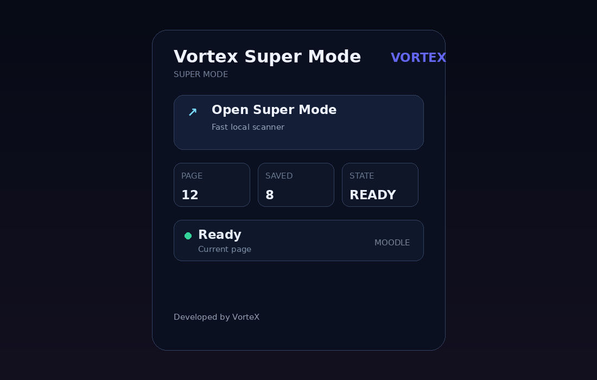
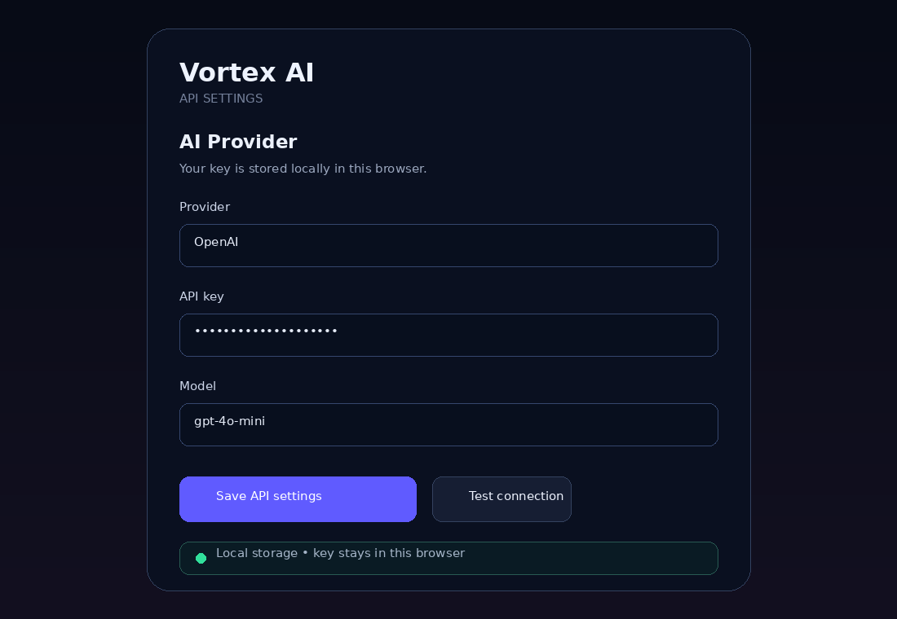
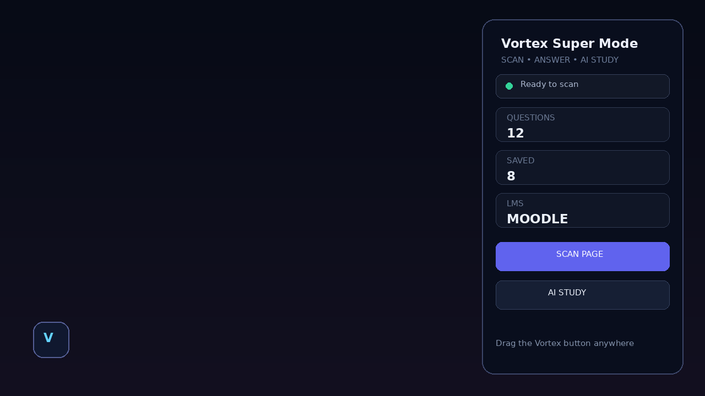
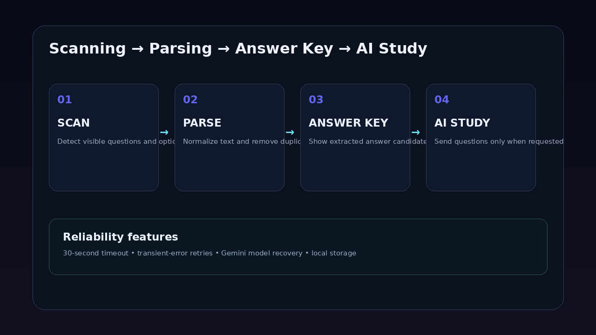

# LMS Moodle Quiz Solver Automatic with AI

```{=html}
<p align="center">
```
``{=html}
```{=html}
</p>
```
```{=html}
<h2 align="center">
```
Vortex Super Mode
```{=html}
</h2>
```
```{=html}
<p align="center">
```
`<b>`{=html}Fast local question scanning • AI Study • resilient AI
connectivity • draggable Super Mode UI`</b>`{=html}
```{=html}
</p>
```
```{=html}
<p align="center">
```
``{=html}
``{=html}
``{=html}
``{=html}
```{=html}
</p>
```
```{=html}
<p align="center">
```
``{=html}
```{=html}
</p>
```
> **Repository name:** `lms-moodle-quiz-solver-automatic-with-ai`

## Overview

**LMS Moodle Quiz Solver Automatic with AI** is a Chromium/Chrome
Manifest V3 extension built around **Vortex Super Mode**. It combines
local question scanning, option extraction, duplicate filtering,
answer-key presentation, optional AI Study, multiple configurable AI
providers, persistent local settings, and a draggable floating control.

The scanner contains detection strategies for radio groups, checkbox
groups, ARIA-based controls, and Google Forms-style layouts. Moodle is
one of the intended LMS environments.

## Feature overview

  -------------------------------------------------------------------------
  Feature                             Description
  ----------------------------------- -------------------------------------
  Local MCQ scanner                   Detects visible radio/checkbox/ARIA
                                      question structures

  Moodle-oriented workflow            Designed with LMS quiz pages in mind

  Duplicate filtering                 Uses normalized question hashing

  Draggable Vortex button             Floating control can be repositioned

  Super Mode panel                    Compact panel for scanning and
                                      controls

  Answer Key popup                    Displays scan results separately

  AI Study                            Optional AI-assisted question
                                      analysis

  Multiple AI providers               OpenAI, Gemini, Anthropic, Groq,
                                      OpenRouter and custom
                                      OpenAI-compatible

  Local API-key storage               Provider settings are kept in Chrome
                                      local storage

  Retry handling                      Transient/network/rate-limit/server
                                      failures can be retried

  Timeout handling                    AI requests use a 30-second timeout

  Gemini recovery                     Model discovery/recovery behavior for
                                      unavailable saved Gemini model IDs

  Manifest V3                         Modern Chromium extension
                                      architecture
  -------------------------------------------------------------------------

## AI provider support

The settings page exposes **OpenAI, Google Gemini, Anthropic Claude,
Groq, OpenRouter, and Custom OpenAI-compatible** providers. Custom
endpoint/model values are supported for compatible providers. Provider
model names can change, so update them when necessary.

## Visual system, themes and effects

The supplied UI uses a dark futuristic style with glassmorphism-inspired
surfaces, rounded cards, gradient actions, soft borders, shadows,
backdrop blur, hover elevation, active/pressed scaling, draggable-state
scaling, status indicators, compact metric cards, and responsive sizing.

Suggested themes: - **Vortex Dark:** navy + indigo + cyan - **Neon:**
black + purple + cyan + glow - **Minimal:** dark gray + white +
low-saturation borders - **Light:** white + soft gray + indigo

The README also includes an animated SVG loading banner at
`docs/vortex-loading.svg`.

## Screenshots

> The following are **UI previews generated from the supplied project
> structure and source styling** for documentation.

### 1. Extension popup



Shows Vortex branding, Open Super Mode, page/saved/state metrics,
status, LMS area, and creator attribution.

### 2. AI settings



Shows provider selection, API-key field, model field, save/test actions,
and local-storage security notice. The real page is `api-settings.html`.

### 3. Super Mode overlay



Shows the floating Vortex control, compact panel, live status, metrics,
scan action, and AI Study action. Main overlay styling is in
`styles/content.css`.

### 4. Scan workflow



``` text
PAGE → SCAN → PARSE / NORMALIZE → DUPLICATE FILTER → ANSWER KEY → OPTIONAL AI STUDY
```

## Project structure

``` text
lms-moodle-quiz-solver-automatic-with-ai/
├── manifest.json
├── background.js
├── content.js
├── api-settings.html
├── api-settings.js
├── README.md
├── popup/
├── assets/
├── modules/
├── styles/
└── docs/
    ├── screenshots/
    └── vortex-loading.svg
```

## Download

### ZIP

On GitHub use **Code → Download ZIP**, then extract the archive.

### Git

``` bash
git clone https://github.com/<your-username>/lms-moodle-quiz-solver-automatic-with-ai.git
cd lms-moodle-quiz-solver-automatic-with-ai
```

## Installation

### Chrome / Chromium / Edge

1.  Download or clone the repository.
2.  Extract the ZIP.
3.  Open `chrome://extensions` (Chrome) or `edge://extensions` (Edge).
4.  Enable **Developer mode**.
5.  Click **Load unpacked**.
6.  Select the root folder containing `manifest.json`.
7.  Pin the extension if desired.

Do **not** select only the `popup` folder.

## AI setup

1.  Install the extension.
2.  Open the extension options/settings page.
3.  Select your provider.
4.  Enter the API key.
5.  Confirm the model.
6.  For custom OpenAI-compatible APIs, enter the endpoint.
7.  Click **Save API settings**.
8.  Click **Test connection**.
9.  Return to the target page and use **AI Study** when needed.

AI settings are stored through `chrome.storage.local`. Never commit a
real API key.

## How to use

### Basic scan

``` text
Install → Open LMS page → Open Vortex → Scan → Review detected questions
```

### AI Study

``` text
Scan → Review questions → AI Study → Provider request → AI response
```

AI Study is optional; local scanning does not require an AI API key.

## How the scanner works

1.  **Radio groups** --- traditional multiple-choice inputs.
2.  **Checkbox groups** --- multi-select question structures.
3.  **ARIA roles** --- modern LMS/form semantics.
4.  **Google Forms patterns** --- additional form-specific detection.
5.  **Filtering** --- removes empty/short results and similar
    duplicates.

## Reliability and privacy

### Reliability

The supplied source includes a 30-second AI request timeout, retry
handling for transient/network/rate-limit/server failures, Gemini model
discovery/recovery for unavailable saved model IDs, and local
storage/caching helpers.

### Privacy

The extension requests broad page access because it inspects question
controls on web pages. Review `manifest.json` permissions before
installation and only use it where permitted. API keys are secrets;
never publish them.

## Customization and animations

Main UI files:

``` text
styles/content.css
styles/settings.css
popup/popup.css
```

You can modify gradients, backgrounds, borders, shadows, blur, radius,
typography, hover/active effects, buttons, scan pulses, loading
indicators, success animations, panel transitions, and theme colors.
Keep selectors scoped to the extension.

## Troubleshooting

**Extension does not appear:** enable Developer mode, select the root
folder, confirm `manifest.json`, and inspect extension errors.

**No questions detected:** ensure questions are visible, the page
finished loading, and the controls use a supported structure.

**AI connection fails:** verify API key, provider, endpoint, model,
quota/account, and network access, then use **Test connection**.

**Gemini model error:** update the model in AI settings. The project
contains recovery/model-discovery behavior for unavailable model IDs.

## Open-source credit and disclaimer

This project is provided as an **open-source project by VorteX**.

You may use it as a starting point, study the source, modify the UI,
redesign the interface, add features, and adapt it for permitted
environments.

### Credit requirement

If you reuse, modify, redistribute, or publish a derivative version,
**please keep clear credit to the original creator, VorteX**. Do not
remove the original creator attribution and present the entire project
as if you created it from scratch.

Recommended credit:

``` text
Original project / base: Vortex Super Mode
Creator: VorteX
Repository: lms-moodle-quiz-solver-automatic-with-ai
```

### Responsible-use disclaimer

Use the project only in ways allowed by your institution, LMS,
applicable law, API-provider terms, and website policies. Do not use it
to bypass access controls, defeat security mechanisms, or violate
assessment rules.

The creator is not responsible for misuse, academic-policy violations,
account restrictions, API charges, or changes made by third-party
platforms/providers.

## Creator

### ⚡ VorteX

**Creator / Developer**

Open-source project maintained under the **VorteX** name.

## License note

No formal OSI license file was included in the supplied archive. If you
want legally clear permissions for modification and redistribution, add
a `LICENSE` file with terms matching your intended permissions. Until
then, do not assume a standard open-source license automatically
applies.

```{=html}
<p align="center">
```
`<b>`{=html}Built with a Vortex mindset --- fast, modular,
customizable.`</b>`{=html}
```{=html}
</p>
```
